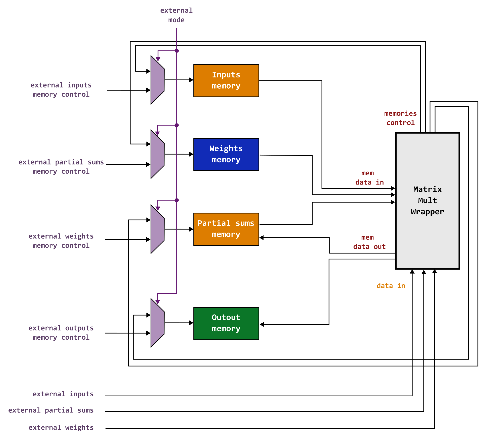
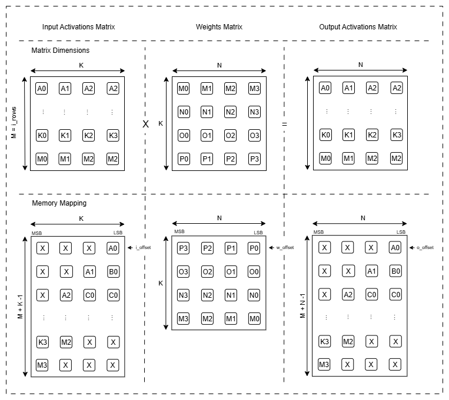

# GEMM Accelerator: Weight Stationary Systolic Array

A hardware accelerator for dense matrix multiplication implemented in SystemVerilog. This project implements a systolic array architecture optimized for high-performance, energy-efficient matrix operations commonly used in AI/ML workloads.

You can find a list of projects that make use of the accelerator towards the end of the repository.

**Note:** This project's design & implementation were used as the safety module for the Hive SoC Tapeout (ECE4804: Theory to Tapeout). None of the physical design implementation details are shared in this repository.

## Overview

A systolic array is a specialized parallel computing architecture where multiple processing elements (PEs) work in concert, with each PE communicating only with its neighbors. This design achieves high inference throughput and energy efficiency by minimizing data movement and maximizing compute density. This implementation supports configurable array dimensions, and multiple data formats.

### Key Capabilities

- **Scalable Architecture**: Configurable systolic array dimensions (up to 16×16 PEs)

- **Multiple Data Formats**: 8-bit, 16-bit, 32-bit integers and floating-point (float16, float32, float8_e4m3)

- **Comprehensive Verification**: Automated test generation and reference model verification (golden model)

- **EDA Tool Integration**: Synopsys VCS, Design Compiler, and ICC support

## Architecture

### High-Level Design

The systolic array performs matrix multiplication through a pipeline of activities:

1. **Preload Phase**: Weight matrix is loaded from the buffer into PE's weight registers

2. **Streaming Phase**: Input activations flow from the buffer through the array while partial results accumulate. Activations require a staggered format

3. **Drain Phase**: Final results are collected and written to the output buffer

### Core Components

<p align="center">

</p>

### Module Hierarchy

- **Matrix Multiplication Top Level** (`matrix_mult_wrapper.sv`)
  - Integrates the computation array & controller
  - Scratch buffers used to supply per cycle data during computation

- **Matrix Multiplication Controller** (`sa_control.sv`)
  - Main orchestrator managing data flow between memory and array
  - Handles configuration and state sequencing

- **Systolic Array Compute Block** (`sa_compute.sv`)
  - Grid of processing elements (PEs)
  - Data routing and pipeline control

- **Processing Element** (`sa_pe.sv`)
  - Individual computation unit
  - Multiply-accumulate (MAC) operation
  - Local weight storage

- **Memory Subsystem**
  - Input activation buffer
  - Weight buffer
  - Output/partial sums buffer
  - Multiple implementations: behavioral, realistic emulator, and DesignWare-based

## Project Structure

```
systolic_public/
├── README.md                       # This file
├── LICENSE                         # MIT License
├── docs/
│   └── PPA_analysis.pdf            # Power, Performance, and Area analysis
└── sim/                            # Simulation output directories
│   ├── behav/                      # Behavioral simulation results
│   ├── syn/                        # Post-synthesis simulation results
│   └── apr/                        # Post-APR simulation results
└── src/
    ├── rtl/                        # Register Transfer Logic
    │   ├── systolic/               # Systolic array core modules
    │   ├── matmul/                 # Matrix multiplication controller
    │   ├── memory/                 # Memory subsystem
    │   ├── bist/                   # Built-in self-test
    │   └── misc/                   # Utilities (clock domain crossing, shift registers)
    ├── verif/                      # Verification infrastructure
    │   ├── testbench/              # Simulation testbenches
    │   └── scripts/                # Test generation and verification scripts
    ├── makefiles/                  # Build system
    │   ├── Makefile_behav_sim      # Behavioral simulation
    │   └── ...                     # Additional flow makefiles

```

## Getting Started

### Prerequisites

- **SystemVerilog Simulator**: Synopsys VCS (recommended) or equivalent
- **Synthesis Tools**: Not Supported on this Public Version
- **Place & Route**: Not Supported on this Public Version
- **Python 3.x**: For test generation and verification scripts
- **Make**: Build system

### Quick Start: Behavioral Simulation

1. **Initialize Sim Directory**:
   ```
   cd sim/behav
   make link
   ```

2. **Generate test data**:
   ```
   make mem
   ```

3. **Run simulation**:
   ```
   make vcs
   ```

4. **Verify results**:
   ```
   make verif
   ```

## Configuration

Default configuration can be modified through Makefile parameters:

| Parameter | Default | Description |
|-----------|---------|-------------|
| `DATA_WIDTH` | 16 | Data width in bits (8, 16, or 32) |
| `M` | 8 | Matrix A rows / output rows |
| `K` | 8 | Matrix A columns / Matrix B rows |
| `N` | 8 | Matrix B columns / output columns |
| `PE_ROWS` | 8 | Systolic array row count |
| `PE_COLS` | 8 | Systolic array column count |
| `TEST_COUNT` | 100 | Number of test vectors |
| `DATA_FORMAT` | INT | Data format (INT, FLOAT) |

### Example: Custom Configuration

```bash
make vcs DATA_WIDTH=32 M=16 K=16 N=16 PE_ROWS=16 PE_COLS=16
```

## Scripts & Usage

### Test Data Generation

Generate random test vectors for simulation:

```bash
python3 scripts/data_gen.py
  -d 32         # data width
  -d 16 8 8     # M, K, N dimensions
  -f 0          # 0: Integer | 1: Float
  -n 200        # number of tests
```

Supported formats: `int8`, `int16`, `int32`, `float16`, `float32`, `float8_e4m3`

### Running Simulations

For this Public Version, only behavioral simulations are supported. Post-syn and post-apr simulations are not supported. Makefiles for running sims can be found under `src/makefiles`

```bash
make vcs        # calls VCS and executes simv
```

### Verification

Compare hardware simulation results against golden reference:

```bash
python3 scripts/verify.py
  -d 32         # data width
  -d 16 8 8     # M, K, N dimensions
  -a 8 8        # physical array dimensions (K, N)
  -f 0          # 0: Integer | 1: Float
  -n 200        # number of tests
```

The verification script will generate an output log `verif_summary.log` with the results of each test. The verification summary can be extracted as:

```bash
head -n 4 verif_summary.log
```

## Key Features

### Modularity

- Supports 4x4 to 16x16 physical computation array dimensions
- Parameterized scratch buffer dimensions

### Data Format Support

- **8-bit Integer**: for edge AI inference
- **16-bit Integer**: compact integer format (used on some AI models)
- **32-bit Integer**: traditional integer support
- **8-bit Float (e4m3)**: emerging ultra-low precision format
- **16-bit Float**: efficient ML workloads
- **32-bit Float**: high-precision applications/workloads

Note that the data generation script `data_gen.py` performs the necessary transformations to the input matrices so that they can be loaded to the memory accordingly. The following diagram shows the expected formatting on the memory:

<p align="center">

</p>

### Verification Infrastructure

- Automated test generation with configurable parameters
- Golden value is computed using Python's `numpy` library alongside data type libraries such as `ml_dtpyes`
- Automated result comparisson between python's golden output and systolic array's output
- Post-synthesis and post-APR simulation capabilities (Not supported on this public version)

## Performance Exploration

This systolic-based GEMM accelerator was used on the following projects to explore and understand the tradeoffs in PPA for different data format and memory configurations.

### Project 1: An Analysis on the Effects of Variable Bit Precision and Dynamic Range on Power, Area, and Accuracy in a 65 nm GEMM Accelerator

Power, Performance, and Area (PPA) analysis & comparison for all supported data formats is provided under the project report `PPA_analysis.pdf`. This report was used as a deliverable for the explorational final project for ECE 6135: Digital Systems at Nanometer Nodes.

- See `docs/PPA_analysis.pdf` for detailed implementation metrics
- Includes area breakdown, power consumption, and performance characterization for post-synthesis netlist results

## References

### IEEE/Industry Standards

- IEEE 754 (Floating-Point) - Technical Standard for Floating-Point arithmetic

### Papers

- Kung, H.T., "Why Systolic Architectures?" IEEE Computer, 1982
- TPU architecture (Google) - Practical systolic deployment in ML accelerators

